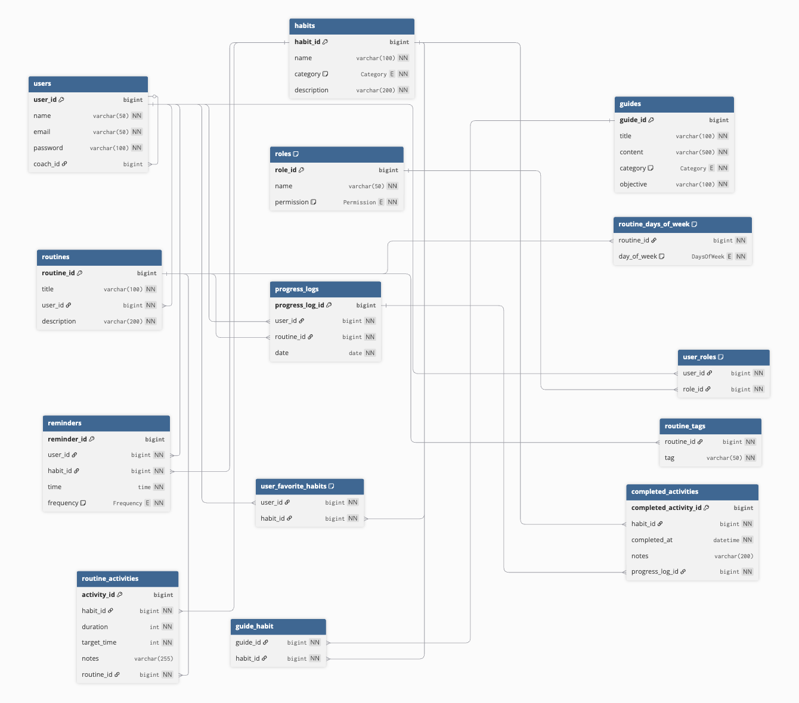

# HealthyHabits GraphQL API

> Plataforma modular para orquestar hábitos saludables mediante una API GraphQL segura, escalable y documentada con ejemplos listos para ejecutar.

---

## Resumen ejecutivo
HealthyHabits centraliza el acompañamiento de rutinas, recordatorios y progreso de usuarios enfocados en mejorar su bienestar. La aplicación está construida con Spring Boot 3.5.4, Java 21 y MariaDB, exponiendo un esquema GraphQL integral que reduce acoplamientos frente a clientes web o móviles. La capa de seguridad aplica JWT firmados con HS256, políticas estrictas de contraseñas y verificación de permisos atómicos antes de ejecutar cualquier resolver.

## Diagrama de la Base de datos: 




### Propósito y valor inmediato
- Consolidar en un solo backend el seguimiento de hábitos, rutinas personalizadas, guías educativas y bitácoras de progreso.
- Ofrecer a coaches, estudiantes y auditores un punto de acceso seguro y trazable con control de roles granular.
- Permitir despliegues rápidos tanto en entornos de desarrollo (Maven) como en infraestructura contenedorizada (Docker Compose o imágenes OCI generadas con Buildpacks).

### Capacidades clave por módulo
- **Usuarios y roles**: registro, autenticación, asignación de permisos, relación coach-estudiante, favoritos y estadísticas.
- **Hábitos y guías**: catálogo categorizado, recomendaciones basadas en objetivos y contenidos educativos asociados.
- **Rutinas y actividades**: definición de planes semanales con actividades programadas, duración estimada y etiquetas.
- **Recordatorios**: configuración diaria o semanal, alineados con hábitos y zonas horarias del usuario.
- **Progreso**: bitácoras detalladas, actividades completadas y KPIs semanales/mensuales para seguimiento.

### Funcionamiento en alto nivel
1. Inicializadores (`RoleInitializer` y `AdminInitializer`) crean permisos y una cuenta administrativa si hay credenciales configuradas.
2. Clientes (GraphiQL, front-ends o integraciones) interactúan con `/graphql`, autenticándose con `Authorization: Bearer <token>`.
3. Los resolvers delegan en servicios de dominio que validan reglas, consultan repositorios Spring Data y retornan DTOs.
4. `GlobalExceptionHandler` estandariza los errores GraphQL para que clientes reciban códigos consistentes.
5. La observabilidad se complementa con Actuator, logging estructurado y configuraciones listas para enviar métricas.

### Seguridad y gobierno
- Tokens JWT rotables, firmados con un secreto configurable y con expiración ajustable por variable de entorno.
- Roles autogenerados por permiso (`HABIT_READ`, `ROUTINE_EDITOR`, etc.) que simplifican la asignación en flujos administrativos.
- Política de contraseñas con mayúsculas, minúsculas, dígitos y longitud mínima, reforzada con un *pepper* configurable.
- Matriz de permisos documentada en el [Apéndice B](#apéndice-b-matriz-de-permisos) para guiar auditorías.

## Despliegue express con Docker, datos masivos y Postman
1. Clona el repositorio y crea un archivo `.env` con las variables mínimas (`MARIADB_ROOT_PASSWORD`, `MARIADB_DATABASE`, `MARIADB_USER`, `MARIADB_PASSWORD`, `JWT_SECRET`, `PASSWORD_PEPPER`, `APP_ADMIN_PASSWORD`). Puedes agregar `APP_ADMIN_EMAIL` si deseas personalizar la cuenta administrativa.
2. Construye las imágenes con `docker compose build` para garantizar que la aplicación utilice tu configuración local actual.
3. Arranca los servicios con `docker compose up -d` y espera a que MariaDB se marque como `healthy` (verifícalo con `docker compose ps` o `docker compose logs -f mariadb`).
4. Semilla la base con el dataset pesado (~500&nbsp;000 registros agregados entre usuarios, hábitos, rutinas y bitácoras) ejecutando `docker compose exec -T mariadb mariadb -u"$MARIADB_USER" -p"$MARIADB_PASSWORD" "$MARIADB_DATABASE" < docs/healthy_habits_seed.sql`. Ajusta los parámetros dentro del archivo SQL si necesitas un volumen distinto.
5. La aplicación expondrá GraphQL en `http://localhost:8080/graphql` y GraphiQL en `http://localhost:8080/graphiql`. Verifica el estado con los logs.
6. En Postman (o cualquier cliente HTTP) crea una petición `POST` a `http://localhost:8080/graphql`, selecciona el modo *GraphQL* y envía la mutación de inicio de sesión del administrador para obtener un token JWT:


  mutation {
  login(input: { email: "admin@healthyhabits.com", password: "AdminPsw123" }) {
    token
    expiresAt
    user {
      id
      name
      email
      roles {
        name
        permission
      }
    }
  }
}


   Copia el `token` de la respuesta y agrégalo como encabezado `Authorization: Bearer <token>` para el resto de mutaciones y consultas protegidas.
7. Una vez autenticado podrás crear usuarios, hábitos, rutinas u operar con el dataset masivo tanto desde Postman como desde GraphiQL.

### Beneficios para cada perfil
- **Equipo de producto**: ciclo corto de experimentación, datos masivos generables con el seeder y reportes de progreso.
- **Equipo de ingeniería**: arquitectura por capas, DTOs aislados, pruebas con Maven y configuraciones externas.
- **Operaciones**: métricas Actuator, logs JSON, variables centralizadas y despliegue reproducible.
- **Auditoría**: permisos explícitos, trazabilidad de acciones y documentación con ejemplos de queries listos.


## Panorama funcional
- HealthyHabits es una API GraphQL que concentra hábitos, rutinas y progreso, ofreciendo endpoints tipados y autodescriptivos.
- La capa de presentación expone queries paginadas y mutaciones idempotentes enfocadas en escenarios reales: registrar usuarios, generar recomendaciones, planificar actividades y monitorear adherencia.
- Incluye utilidades para inicialización (roles, administrador), seeding masivo, logging estructurado, métricas Actuator y scripts de despliegue con Docker Compose.
- Todo el estado sensible (contraseñas, tokens) se protege con hashing, secretos externos y una matriz de permisos documentada.

## Arquitectura y componentes
HealthyHabits adopta un enfoque por capas con responsabilidades claras que simplifican la evolución del esquema GraphQL.

### Capas principales
- **Capa de presentación**: resolvers GraphQL en `src/main/java/task/healthyhabits/resolvers` traducen peticiones del cliente a invocaciones de servicios.
- **Capa de servicios**: `services` implementa reglas de negocio, validaciones adicionales y coordinación con repositorios.
- **Capa de persistencia**: repositorios Spring Data en `repositories` encapsulan consultas y criterios personalizados sobre MariaDB.
- **Configuración**: el paquete `config` registra *beans* (scalars, inicializadores, CORS, seeder) y perfiles.
- **Seguridad**: el paquete `security` ofrece filtro JWT, `JwtService`, `PasswordHashService`, utilidades y manejo de contraseñas.
- **DTOs y transformaciones**: `dtos` y `transformers` separan el dominio de la capa GraphQL.
- **Gestión de errores**: `GlobalExceptionHandler` unifica los mensajes de error y códigos para clientes GraphQL.

### Dependencias destacadas
- Spring Boot starters: GraphQL, Web, Security, Data JPA, Validation, Actuator y Log4j2.
- MariaDB como base relacional por defecto, configurable hacia otras bases compatibles.
- Faker para generación sintética en el seeder.
- JJWT para firma y verificación de tokens.
- Lombok para reducir código repetitivo en entidades y servicios.

### Ciclo de ejecución
1. `HealthyhabitsApplication` arranca e inicializa *beans* esenciales.
2. `RoleInitializer` crea roles derivados de cada permiso definido en el enum `Permission`.
3. `AdminInitializer` configura un usuario administrador si existen credenciales seguras.
4. `JwtAuthFilter` valida tokens entrantes y puebla el contexto de seguridad de Spring.
5. Resolvers invocan `SecurityUtils.requireAny` para asegurar permisos antes de ejecutar lógica de negocio.
6. Servicios consultan repositorios JPA, transforman entidades y devuelven DTOs.
7. Errores se traducen mediante `GlobalExceptionHandler`, generando `GraphQLError` consistentes.

## Modelo de dominio

### Entidades clave
- **User**: nombre, correo, contraseña cifrada, roles, hábitos favoritos y relación opcional con un coach.
- **Role**: mapea un nombre a un permiso atómico (`Permission`).
- **Permission**: enum que abarca lectura/edición de usuarios, hábitos, rutinas, recordatorios, progreso, guías y auditoría.
- **Habit**: hábitos categorizados con `Category`, descripción y metadatos.
- **Guide**: contenidos educativos enlazados a categorías, objetivos y recomendaciones.
- **Routine**: plan personalizado con actividades asociadas (`RoutineActivity`).
- **RoutineActivity**: duración, notas, objetivo y vínculo a un hábito.
- **Reminder**: recordatorio con frecuencia (diaria/semanal), horario y unión usuario-hábito.
- **ProgressLog**: bitácora diaria asociada a usuario y rutina.
- **CompletedActivity**: marca temporal y notas de cada actividad completada.
- **CategoryCount / WeeklyProgress / MonthlyStat**: DTOs de agregación usados en estadísticas.

### Relaciones destacadas
- Un usuario puede ser coach de múltiples usuarios y gestionar hábitos favoritos.
- Las rutinas pertenecen a un usuario y contienen varias actividades, cada una asociada a un hábito.
- Los recordatorios vinculan usuarios y hábitos, creando alertas personalizadas.
- Cada bitácora (`ProgressLog`) conecta usuario y rutina, almacenando actividades completadas.
- Las estadísticas se calculan sobre actividades completadas agrupadas por categoría y fecha.

### Reglas de negocio esenciales
- Correos de usuarios son únicos; la capa de servicio valida duplicados antes de persistir.
- Contraseñas deben cumplir la política mínima antes de codificarse.
- Permisos determinan queries y mutaciones accesibles; los roles se asignan según flujos de negocio.
- El seeder evita duplicados y controla límites de lotes para proteger la base de datos.
- Estadísticas semanales y mensuales operan en UTC para coherencia entre zonas horarias.

## Relaciones y flujo de datos
1. Cliente envía petición GraphQL a `/graphql` con `Authorization` cuando la operación lo requiere.
2. `JwtAuthFilter` valida la firma y expiración del token usando `JwtService`.
3. El resolver invoca `SecurityUtils.requireAny` para verificar permisos.
4. Servicios ejecutan reglas, interactúan con repositorios JPA y construyen DTOs de salida.
5. Los DTOs se serializan según el esquema GraphQL y se devuelven al cliente.
6. `GlobalExceptionHandler` transforma errores en respuestas homogéneas, agregando códigos y mensajes descriptivos.
7. Logs estructurados documentan autenticaciones, ejecuciones de seeder, cálculos de estadísticas y errores críticos.

## Seguridad y autenticación
HealthyHabits adopta un modelo de seguridad estricto basado en JWT y permisos por operación.

### Autenticación JWT
- `JwtAuthFilter` intercepta solicitudes, toma el token del encabezado `Authorization` y valida la firma HS256 con `JwtService`.
- La expiración del token se controla con `JWT_EXPIRATION_MS`; la rotación es manual (nuevos logins invalidan tokens previos por expiración natural).
- Operaciones públicas: `register`, `login`, `verifyToken`. El resto requiere token válido.

### Contraseñas, roles y permisos
- `PasswordHashService` agrega un *pepper* (`PASSWORD_PEPPER`) antes de delegar al `PasswordEncoder` estándar de Spring.
- `DefaultPasswordPolicy` exige mínimo 8 caracteres, incluyendo mayúsculas, minúsculas y dígitos.
- Roles se generan automáticamente según el enum `Permission`, facilitando la asignación en mutaciones de usuarios.
- Los resolvers usan utilitarios (`SecurityUtils.requireAny`) para lanzar `FORBIDDEN` si faltan permisos adecuados.

### Recomendaciones operativas
- Genera un `JWT_SECRET` aleatorio (mínimo 32 bytes en Base64) y rodarlo periódicamente.
- Ajusta `JWT_EXPIRATION_MS` a las necesidades (por ejemplo, 86_400_000 ms = 1 día).
- Controla acceso a GraphiQL en producción (`spring.graphql.graphiql.enabled=false`).
- Expone `/graphql` detrás de HTTPS con *reverse proxy* y aplica *rate limiting* si lo consumes desde aplicaciones públicas.

## Configuración y despliegue
### Requisitos previos
- Java Development Kit 21 (el *wrapper* `mvnw` lo descarga si es necesario).
- Docker Engine 24+ y Docker Compose v2 para despliegue contenedorizado.
- Acceso a una instancia MariaDB 10.11+ o similar.
- Variables de entorno configuradas para JWT, base de datos y seeder.

### Variables de entorno
- Copia `.env.example` como `.env` para tener una plantilla local.
- Ajusta cada valor según tu entorno antes de ejecutar Docker Compose o Maven.
- Variables incluidas:
  - `MARIADB_DATABASE`: nombre de la base de datos que usará la aplicación.
  - `MARIADB_USER` / `MARIADB_PASSWORD`: credenciales de la cuenta de aplicación en MariaDB.
  - `MARIADB_ROOT_PASSWORD`: contraseña del usuario `root` cuando usas el contenedor de MariaDB.
  - `SPRING_JPA_HIBERNATE_DDL_AUTO` (opcional): estrategia de sincronización del esquema de Hibernate.
  - `SPRING_JPA_SHOW_SQL` (opcional): habilita o deshabilita el log de sentencias SQL.
  - `JWT_SECRET`: secreto en Base64 para firmar tokens JWT.
  - `JWT_EXPIRATION_MS`: tiempo de expiración de los tokens JWT en milisegundos.
  - `PASSWORD_PEPPER`: valor adicional que se mezcla antes de cifrar contraseñas.
  - `APP_ADMIN_PASSWORD`: contraseña inicial del administrador autogenerado.

### Ejecución con Maven
1. Asegura que MariaDB esté disponible en `localhost:3306` o actualiza `application.properties`.
2. Exporta variables o carga `.env` en la sesión.
3. Ejecuta `./mvnw spring-boot:run` y espera el log `Started HealthyhabitsApplication`.
4. Abre `http://localhost:8080/graphiql` para interactuar con el esquema.
5. Comprueba salud con `curl http://localhost:8080/actuator/health`.
6. Detén la aplicación con `Ctrl+C`.

### Ejecución con Docker Compose
1. Revisa que `.env` contenga todas las variables.
2. Ejecuta `docker compose up -d --build` para levantar MariaDB y la aplicación.
3. `mariadb` expone `3306` y la aplicación `8080`.
4. Consulta logs con `docker compose logs -f app` o `docker compose logs -f mariadb`.
5. Corre pruebas dentro del contenedor con `docker compose exec app ./mvnw test`.
6. Apaga con `docker compose down` o `docker compose down -v` si deseas limpiar volúmenes.
7. Personaliza `docker-compose.yml` para redes, reinicios o recursos dedicados.

### Ejecución de pruebas
- `./mvnw test`: pruebas unitarias y de integración ligera.
- `./mvnw verify`: empaquetado y validaciones adicionales.
- `./mvnw failsafe:integration-test`: disponible para futuras pruebas de integración.
- Integra herramientas de formato (Spotless, Checkstyle) si se agregan al proyecto.

### Migración y base de datos
- Configuración predeterminada con MariaDB usando `spring.datasource.*`.
- Controla el modo de DDL con `spring.jpa.hibernate.ddl-auto` (`update`, `validate`, etc.).
- Considera Flyway o Liquibase para versionar migraciones en fases posteriores.
- `spring.jpa.show-sql=false` por defecto para evitar ruido; habilítalo en entornos de depuración.
- HikariCP se configura para no fallar en inicialización (`initialization-fail-timeout=-1`).
- En Docker, los datos persisten en el volumen `mariadb_data`.

### Carga del seed SQL desde Docker
- En Windows (PowerShell) puedes hidratar la base de datos leyendo el archivo SQL y canalizándolo al contenedor:

  ```powershell
  Get-Content .\docs\healthy_habits_seed.sql | docker exec -i healthyhabits-db mariadb -uroot -p1234 healthyhabitsdb
  ```

  Este comando usa `Get-Content` para transmitir el `healthy_habits_seed.sql` al proceso `mariadb` que corre dentro del contenedor `healthyhabits-db`.

- En macOS (incluido Apple Silicon/M1) el flujo es equivalente usando utilidades POSIX:

  ```bash
  cat docs/healthy_habits_seed.sql | docker exec -i healthyhabits-db mariadb -uroot -p1234 healthyhabitsdb
  ```

  Aquí `cat` imprime el archivo y `docker exec -i` redirige la entrada estándar al cliente `mariadb`, aplicando el seed con las mismas credenciales.


### Seeder masivo
- Habilítalo con `APP_SEEDER_ENABLED=true`.
- Controla volumen: `APP_SEEDER_TOTAL_RECORDS` (usuarios), `APP_SEEDER_BATCH_SIZE` (lotes) y `APP_SEEDER_LOCALE` (idioma).
- Genera hábitos, usuarios, rutinas, recordatorios, bitácoras y actividades completadas coherentes.
- Respeta límites sugeridos: lotes entre 100 y 5 000, hasta 10 000 usuarios por corrida.
- Evita seeding si existen `ProgressLog` para preservar datos.
- Diseñado para desarrollo y pruebas; valida parámetros antes de ejecutar en producción.

## Comandos operativos
- `./mvnw spring-boot:run`: arranca la aplicación en desarrollo.
- `./mvnw clean package -DskipTests`: compila y empaqueta el JAR sin pruebas.
- `./mvnw test`: ejecuta la suite de pruebas.
- `docker compose up -d --build`: construye imagen y levanta servicios.
- `docker compose logs -f app`: sigue logs en tiempo real.
- `docker compose down -v`: detiene servicios y elimina volúmenes.
- `java -jar target/healthyhabits-*.jar`: ejecuta el artefacto empaquetado.
- `./mvnw dependency:tree`: inspecciona dependencias.
- `./mvnw spring-boot:build-image`: genera imagen OCI usando Buildpacks.

## Observabilidad y mantenimiento
- Logs estructurados en JSON mediante `log4j2.xml`, compatibles con agregadores (ELK, Loki, etc.).
- Endpoints Actuator disponibles: `health`, `info`, `mappings`, `beans`, `conditions`, `configprops`, `env`.
- Niveles de logging configurables (`org.springframework.security`, `org.springframework.graphql`, etc.).
- Para depurar GraphQL, habilita `DEBUG` o `TRACE` según necesidad.
- Integra Micrometer o Prometheus para métricas personalizadas si el escenario lo requiere.

## Flujos de trabajo recomendados
1. **Arranque local**
   - Configura `.env`.
   - Inicia MariaDB (local o Docker).
   - Ejecuta `./mvnw spring-boot:run`.
   - Usa `register` para crear usuario inicial y prueba queries en GraphiQL.
2. **Despliegue rápido**
   - Empaqueta con `./mvnw clean package`.
   - Construye imagen con `docker compose build .` si prefieres no usar Compose.
3. **Ciclo de desarrollo**
   - Agrega pruebas unitarias al extender resolvers o servicios.
   - Usa GraphiQL para validar entradas/salidas.
   - Analiza logs en vivo para confirmar validaciones y excepciones.
4. **Mantenimiento de datos**
   - Respaldos con `docker compose exec mariadb mysqldump ...`.
   - Ajusta seeder para regenerar datos de prueba.
5. **Integración continua**
   - Configura pipelines que ejecuten `./mvnw verify`.
   - Opcional: `./mvnw spring-boot:build-image` para generar imagen lista para despliegue.

## Guía de consumo GraphQL
### Uso general
- Endpoint único: `POST http://localhost:8080/graphql`.
- GraphiQL habilitado en `http://localhost:8080/graphiql` para exploración interactiva.
- Paginación estándar: argumentos `page`, `size`, y campos de respuesta `number`, `totalElements`, `hasNext`.
- Adjunta `Authorization: Bearer <token>` en operaciones protegidas.

### Autenticación
**Mutaciones disponibles**: `register`, `login`. **Query**: `verifyToken`.

Ejemplo de registro con respuesta:

graphql
mutation Register($input: RegisterInput!) {
  register(input: $input) {
    token
    expiresAt
    user {
      id
      email
      roles { name }
    }
  }
}

json
{
  "data": {
    "register": {
      "token": "eyJhbGci...",
      "expiresAt": "2024-09-01T12:00:00Z",
      "user": {
        "id": "USR-001",
        "email": "coach@healthyhabits.com",
        "roles": [{ "name": "HABIT_EDITOR" }]
      }
    }
  }
}

### Gestión de usuarios y roles
**Permisos**: `USER_READ`, `USER_EDITOR`.

Consulta paginada de usuarios:

graphql
query Users($page: Int!, $size: Int!) {
  listUsers(page: $page, size: $size) {
    totalElements
    content {
      id
      name
      email
      roles { permission }
    }
  }
}

Creación de usuario con roles y favoritos:

graphql
mutation CreateUser($input: UserInput!) {
  createUser(input: $input) {
    id
    name
    favoriteHabits { id name }
    roles { name }
  }
}


### Hábitos y guías
**Permisos**: `HABIT_READ`, `HABIT_EDITOR`, `GUIDE_READ`, `GUIDE_EDITOR`.

Query de hábitos por categoría con respuesta resumida:

graphql
query HabitsByCategory($category: Category!, $page: Int!) {
  listHabitsByCategory(category: $category, page: $page, size: 5) {
    content {
      id
      name
      category
    }
  }
}

json
{
  "data": {
    "listHabitsByCategory": {
      "content": [
        { "id": "HAB-101", "name": "Meditación matutina", "category": "MINDFULNESS" },
        { "id": "HAB-115", "name": "Caminata de 20 minutos", "category": "FITNESS" }
      ]
    }
  }
}


Recomendaciones personalizadas de guías:

graphql
query RecommendedGuides($for: ID!, $size: Int!) {
  listRecommendedGuides(forUserId: $for, page: 0, size: $size) {
    content {
      id
      title
      objective
    }
  }
}


### Rutinas y actividades
**Permisos**: `ROUTINE_READ`, `ROUTINE_EDITOR`.

Crear rutina con actividades embebidas:

graphql
mutation CreateRoutine($input: RoutineInput!) {
  createRoutine(input: $input) {
    id
    title
    daysOfWeek
    activities {
      id
      habit { name }
      duration
    }
  }
}

json
{
  "data": {
    "createRoutine": {
      "id": "ROU-001",
      "title": "Rutina matutina",
      "daysOfWeek": ["MONDAY", "WEDNESDAY", "FRIDAY"],
      "activities": [
        { "id": "ACT-010", "habit": { "name": "Estiramiento" }, "duration": 15 },
        { "id": "ACT-011", "habit": { "name": "Cardio ligero" }, "duration": 20 }
      ]
    }
  }
}


### Recordatorios y favoritos
**Permisos**: `REMINDER_READ`, `REMINDER_EDITOR`.

Mutación para crear recordatorio diario:

graphql
mutation Reminder($input: ReminderInput!) {
  createReminder(input: $input) {
    id
    frequency
    time
    habit { name }
  }
}


Listado de hábitos favoritos del usuario autenticado:

graphql
query Favorites($page: Int!, $size: Int!) {
  listMyFavoriteHabits(page: $page, size: $size) {
    content { id name category }
    totalElements
  }
}


### Progreso y estadísticas
**Permisos**: `PROGRESS_READ`, `PROGRESS_EDITOR`.

Registrar progreso diario con actividades completadas:

graphql
mutation LogProgress($input: ProgressLogInput!) {
  createProgressLog(input: $input) {
    id
    date
    completedActivities {
      id
      habit { name }
      completedAt
    }
  }
}


Obtener estadística semanal:

graphql
query Weekly($user: ID!, $start: Date!) {
  getWeeklyStats(userId: $user, weekStart: $start) {
    weekStart
    daily {
      date
      completedCount
    }
  }
}


### Errores comunes del cliente
- `UNAUTHORIZED`: token ausente o inválido.
- `FORBIDDEN`: permisos insuficientes para la operación solicitada.
- `BAD_REQUEST`: validaciones fallidas (campos obligatorios, formatos, duplicados).
- `NOT_FOUND`: ID inexistente en repositorios (`get*ById`).

## Buenas prácticas
- Mantén secretos fuera del repositorio y rota claves regularmente.
- Asigna roles específicos a cada equipo (coaches con `ROUTINE_EDITOR`, administradores con `USER_EDITOR`, auditores con `AUDITOR`).
- Limita tamaños de página para evitar respuestas pesadas.
- Prefiere actualizar recursos existentes sobre eliminar y recrear.
- Documenta nuevas operaciones en el esquema y en este README.
- Valida entradas en servicios antes de llegar a la base de datos.

## Resolución de problemas
- **Error de conexión a la base**: revisa credenciales `MARIADB_*` y disponibilidad del puerto 3306.
- **Tokens rechazados**: verifica coincidencia de `JWT_SECRET` y expiración según `JWT_EXPIRATION_MS`.
- **`FORBIDDEN` en resolvers**: confirma permisos asignados al usuario.
- **Seeder lento**: reduce registros o ajusta `APP_SEEDER_BATCH_SIZE`.
- **GraphiQL inaccesible**: valida `spring.graphql.graphiql.enabled=true` y configura CORS si accedes desde otro dominio.
- **Logs excesivos**: ajusta `LOGGING_LEVEL_ORG_SPRINGFRAMEWORK_SECURITY=INFO` u otros niveles.
- **Errores de integridad**: comprueba IDs antes de mutar; usa `get*ById` para verificar relaciones.

## Recursos adicionales
- [Spring GraphQL](https://spring.io/projects/spring-graphql)
- [Especificación GraphQL](https://spec.graphql.org/)
- [Guía de seguridad Spring Boot](https://spring.io/guides/gs/securing-web/)
- [JJWT](https://github.com/jwtk/jjwt)
- [MariaDB Documentation](https://mariadb.com/kb/en/documentation/)
- [Docker Compose](https://docs.docker.com/compose/)


